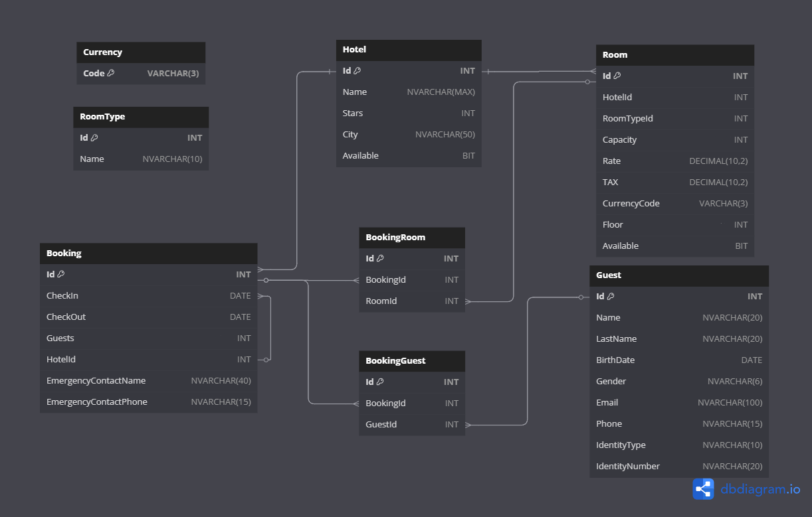

> [!TIP]
> If you are working with Azure SQL and you can't connect
> to the server you can check if the database status is *Paused*.
> In that case you can resume with az sql db update --resource-group <group_name> --server <server_name> --name dbname --set status=Online

# TravelCompany-API 🏝️

API for reservation and travel management, developed in **.NET** and deployed in **Railway** with SQL database deployed in **Azure**.

This project is available on https://travelcompany-api-production.up.railway.app/swagger/index.html

## 🚀 Technologies Used
- **.NET 8**
- **Entity Framework Core**
- **SQL Server**
- **Railway (API Cloud Deployment)**
- **Swagger for Documentation**
- **Azure (SQL Server Cloud Deployment)**

## 📥 Getting Started
These instructions will give you a give to install and run the
project in your local machine. If you need a deployment give please
check the Deployment section.

### 📂 Project structure
This project has the following structure:
```
└── 📁TravelCompanyAPI
    └── 📁TravelCompany.Application
        └── 📁Contracts
            └── BookingRequest.cs
        └── 📁Helpers
            └── EmaiSenderHelper.cs
        └── 📁Interfaces
            └── IBookingGuestRepository.cs
            └── IBookingRepository.cs
            └── IBookingRoomRepository.cs
            └── IGenericRepository.cs
            └── IGuestRepository.cs
            └── IHotelRepository.cs
            └── IRoomRepository.cs
        └── 📁Services
            └── BookingGuestService.cs
            └── BookingRoomService.cs
            └── BookingService.cs
            └── GuestService.cs
            └── HotelService.cs
            └── RoomService.cs
    └── 📁TravelCompany.Domain
        └── 📁Entities
            └── 📁DB
                └── Booking.cs
                └── BookingGuest.cs
                └── BookingRoom.cs
                └── Guest.cs
                └── Hotel.cs
                └── Room.cs
            └── 📁Enum
                └── Currency.cs
                └── Gender.cs
                └── IdentityType.cs
                └── RoomType.cs
    └── 📁TravelCompany.Infraestructure
        └── 📁Persistence
            └── CoreDBContext.cs
        └── 📁Repository
            └── BookingGuestRepository.cs
            └── BookingRepository.cs
            └── BookingRoomRepository.cs
            └── GenericRepository.cs
            └── GuestRepository.cs
            └── HotelRepository.cs
            └── RoomRepository.cs
    └── 📁TravelCompanyAPI
        └── appsettings.Development.json
        └── appsettings.json
        └── 📁Controllers
            └── AdminController.cs
            └── CustomerController.cs
        └── 📁Extensions
            └── AppExtensions.cs        
        └── Program.cs
        └── 📁Properties
            └── launchSettings.json
        └── TravelCompanyAPI.csproj
        └── TravelCompanyAPI.csproj.user
        └── TravelCompanyAPI.http
    └── .gitattributes
    └── .gitignore
    └── LICENSE.txt
    └── README.md
    └── TravelCompanyAPI.sln
```

### 🔧 Prerequisites
The following software and tools are required for run this project locally:
- [Microsoft Visual Studio](https://visualstudio.microsoft.com)
- [SQL Server Management Studio (SSMS)](https://learn.microsoft.com/en-us/ssms/download-sql-server-management-studio-ssms)

### 🔥 Installing

1. Clone the repository:
```sh
git clone https://github.com/jett220201/TravelCompany-API.git
cd TravelCompany-API
```
2. Set connection string:
```sh
{
  "ConnectionStrings": {
    "travelConnection": "Server={your_server};Initial Catalog={your_db_catalog};Persist Security Info=False;User ID={user};Password={password};MultipleActiveResultSets=False;Encrypt=True;TrustServerCertificate=False;Connection Timeout=30;"
  }
}
```
4. Restore NuGet packages:
```sh
dotnet restore
```
6. Run project:
```sh
dotnet run
```
8. Open Swagger in http://localhost:{port}/swagger

## ⚙️ API architecture
This project follows Clean Architecture principles, dividing the application into well-defined layers:

- **Application 🛠️ → Contains the business logic, rules and use cases.**
- **Domain 📦 → Defines the entities and contracts of the application.**
- **Infrastructure 🏗️ → Manages data persistence, database access and external services.**
- **Presentation (API) 🌍 → Exposes drivers and endpoints for interaction with external clients.**

This separation improves the modularity, maintainability and testability of the code, allowing changing technologies without affecting the core business. 🚀

## 🗂️ Database model
The following diagram explain how the database is defined:


## 📌 API Endpoints

| Method  | Endpoint               | Controller         | Description               | Parameters       | Expected Response |
|---------|------------------------|--------------------|---------------------------|------------------|-------------------|
| `GET`   | `/api/hotel/all`       | `AdminController`  | Retrieves all hotels      | None             | List of hotels (JSON) |
| `POST`  | `/api/hotel/create`    | `AdminController`  | Creates a new hotel       | Hotel data (JSON) | Created hotel |
| `POST`  | `/api/hotel/edit`      | `AdminController`  | Edits an existing hotel   | Hotel data (JSON) | Updated hotel data |
| `POST`  | `/api/hotel/addRoom`   | `AdminController`  | Adds a room to a hotel    | Hotel & Room IDs (JSON) | Updated hotel data |
| `POST`  | `/api/hotel/enable`    | `AdminController`  | Enables a hotel          | Hotel ID  | Updated hotel data |
| `POST`  | `/api/hotel/disable`   | `AdminController`  | Disables a hotel         | Hotel ID  | Updated hotel data |
| `GET`   | `/api/booking/all`     | `AdminController` | Retrieves all bookings  | None             | List of bookings (JSON) |
| `GET`   | `/api/booking/{id}`    | `AdminController` | Retrieves a booking by ID | `id`: Booking ID | Booking details (JSON) |
| `POST`  | `/api/booking/new`     | `CustomerController` | Creates a new booking    | Booking data (JSON) | Confirmation message |
| `GET`   | `/api/room/all`        | `AdminController`   | Retrieves all rooms      | None             | List of rooms (JSON) |
| `POST`  | `/api/room/create`     | `AdminController`   | Creates a new room       | Room data (JSON) | Created room |
| `POST`  | `/api/room/edit`       | `AdminController`   | Edits an existing room   | Room data (JSON) | Updated room data |
| `POST`  | `/api/room/enable`     | `AdminController`   | Enables a room           | Room ID   | Updated room data |
| `POST`  | `/api/room/disable`    | `AdminController`   | Disables a room          | Room ID   | Updated room data |
| `GET`   | `/api/search`          | `CustomerController` | Searches for hotels   | Search query (JSON) | Matching hotels (JSON) |


## 🚀 Deployment
This project has been deployed using Railway for the API and Azure to host the SQL database.

### 🖥️ Railway
For the API deployment you need to create an account in [Railway](https://railway.com/) and then you can connect your 
GitHub repository using any othe way offered by Railway. This project has been deployed using GitHub installation:
1. Connect your GitHub account
2. Choose your repository
3. Railway will deploy your project automatically
4. After the deploy is done you need add a new variable for the database url:
```sh
DATABASE_URL = Server={your_server};Initial Catalog={your_db_catalog};Persist Security Info=False;User ID={user};Password={password};MultipleActiveResultSets=False;Encrypt=True;TrustServerCertificate=False;Connection Timeout=30;
````
5. Deploy your changes.

### ☁️ Azure
For the SQL database you need to create an account in [Azure]() and then you can create some free resources:
1. Go to Create resource
2. Look for database categorie
3. Select Azure SQL and create
4. Select SQL Database
5. Fill the form with your account information (Save your User and Password for the API)
6. In the form you will need to create a SQL Server resource if dont have any one
7. Once you have create your SQL Database you need to change the firewall settings, clic on the firewall option on top
8. Select public access and enable *selected networks*
9. Below on *Firewall Rules* add a new one with IPv4 and use your local IP or the IP of your API.
10. Save and wait for replication.
11. Connect to the database and create the database and tables.

## :octocat: Authors

  - **Juan Esteban Torres Tamayo**

## 📜 License

This project is licensed under the [MIT](LICENSE.md)
License - see the [LICENSE.md](LICENSE.md) file for
details.

